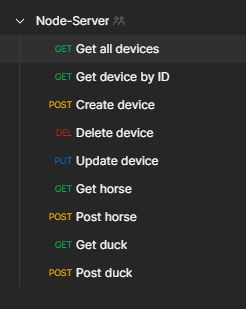

# Node-Server

## Project
This is a Node.js server, made in "serverside scripting" at TEC by Jonas Fuhlendorff.

## Quickstart!

Instruction for quick start the project.

<strong> Start database </strong> \
 Start ``DockerDesktop.exe`` \
 Run ``startDatabase.bat`` script from {root}/infra/docker/startDatabase.bat \
 This will start the database and all what it needs. There is no need for doing anything else. for more information, look at section "MongoDB" and "Docker commands".

<strong>Start node server</strong> \
Run ``npm install`` from CMD in project folder {root} \
Run ``npm start`` \
This will start the Node.js server and create a database in the MongoDB server, if it not alredy exist.

<strong>Test from postman</strong> \
Import ``Node-Server.postman_collection.json`` collection in postman from {root}/infra/postman/Node-Server.postman_collection.json. Here is all the http calls, that can be made. Look at the image bellow.

<strong>This is all you need!</strong>

## Endpoints
This is just an example page, made for demonstration, in class.  
 http://localhost:8000/index.html

## API
The API base route for the API is: \
http://localhost:8000/api/

The calls are structuret like the two examples bellow.

http://localhost:8000/api/{resource}/

or with params

http://localhost:8000/api/{resource}/{param)}

<strong>Possible API calls</strong>

| URL         	| HTTP Method 	| Function                                	| Note                                                             	|
|-------------	|-------------	|-----------------------------------------	|------------------------------------------------------------------	|
| device      	| GET         	| Get all device from database.           	| Gets all the device from one collection.                         	|
| device{id}  	| GET         	| Get specific device by id.              	| It is the user defined ID that is used, not the database ID.     	|
| device      	| POST        	| Create device, and save it in database. 	| Only Json format is supported.                                   	|
| device/{id} 	| DEL         	| Delete a specific device by id.         	| It is the user defined ID that is used, not the database ID.     	|
| device      	| Update      	| Update a specific device, in database.  	| Only Json format is supported.                                   	|
| horse       	| GET         	| This return a string and a method type  	| This is a simple call made en class for demonstration and tests. 	|
| horse       	| POST        	| This return a string and a method type  	| This is a simple call made en class for demonstration and tests. 	|
| duck        	| GET         	| This return a string and a method type  	| This is a simple call made en class for demonstration and tests. 	|
| duck        	| POST        	| This return a string and a method type  	| This is a simple call made en class for demonstration and tests. 	|

## Postman
All API commands can be "imported" to postman by the script in {root}/infra/postman/Node-Server.postman_collection.json. This script contains all possible routs and commands, the API contains.

## MongoDB.

The projects database is a MongoDB running in a docker container. To start the docker container, look at the "Docker commands" section.

Almost all databse stuff is found in {root}/Database/context. This will be split between database stuff and services in the future!

<strong>Connection string: </strong>

``mongodb://localhost:27017/?readPreference=primary&appname=mongodb-vscode%200.6.10&directConnection=true&ssl=false``

### Docker Commands

<strong>Start MongoDB container:</strong> \
Open Powershell and cd to the {root}/infra/docker folder and run compose file with command ``docker-compose up`` or run the ``startDatabase.bat`` script from {root}/infra/docker/startDatabase.bat.

<strong>Stop Mongo container:</strong> \
Open Powershell and cd to the {root}/infra/docker folder and run ``docker-compose down``

<strong>Remove Mongo container:</strong> \
Open Powershell and run ``docker container rm {container id}``